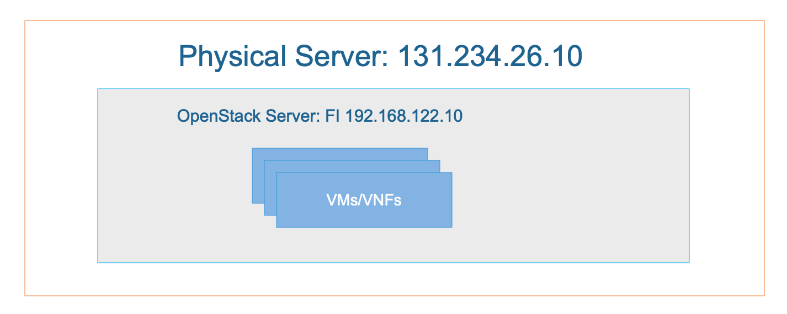
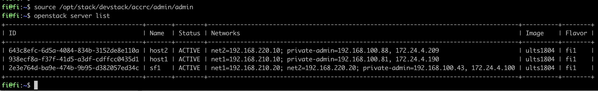
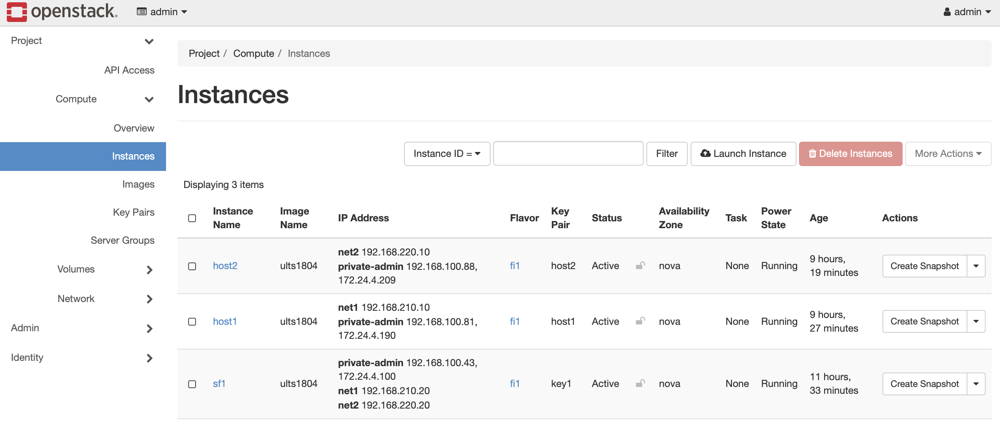
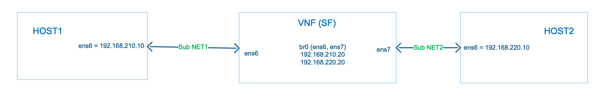

 <b><H1> Lab Setup: High level Diagram </H1>

<b>Login to OpenStack Server   </b>

<b>  1.  ssh backflip@131.234.26.10  </b>   

  
<b>  2.  ssh fi@192.168.122.10   </b>

 

<b>import openstack related information to run command from cli</b>

fi@fi:~$ source /opt/stack/devstack/accrc/admin/admin  

 <b>OpenStack Dashboard:  </b>
http://131.234.26.10   
     

<b> <H1> Login to VNFs using Floating IP address: </H1>

root@fi:~# cd /root  
root@fi:~# ssh -i key1.pri ubuntu@172.24.4.100

root@fi:~# cd /root  
root@fi:~# ssh -i host1.pri ubuntu@172.24.4.190  

root@fi:~# cd /root  
root@fi:~# ssh -i host1.pri ubuntu@172.24.4.209  

 
<b> <H1> Bridge Details: </H1>

root@sf1:~# cat bridge.sh  
#!/bin/bash   
brctl addbr br0  
ifconfig ens6 0.0.0.0 promisc  
ifconfig ens7 0.0.0.0 promisc  
#brctl addif br0 ens6  
#brctl addif br0 ens7  
brctl addif br0 ens6 ens7  
ip addr add 192.168.210.20/24 dev br0  
ip addr add 192.168.220.20/24 dev br0  
ip link set dev br0 up  

 

 
<b><H1>Issue at this moment: </H1> </b>

1. not able to ping host1 to host2 or vice versa

2. from VNF(sf1) we can ping either HOST1 or HOST2

3. Need to work on bridge setup part as it's not allowing bidirectional connection

 
<b>
<H1>Lessons learned: </H1>
1. VMs connectivity to Internet or Physical Network    
2.    

