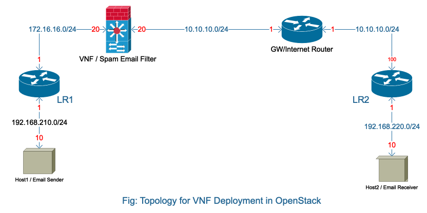
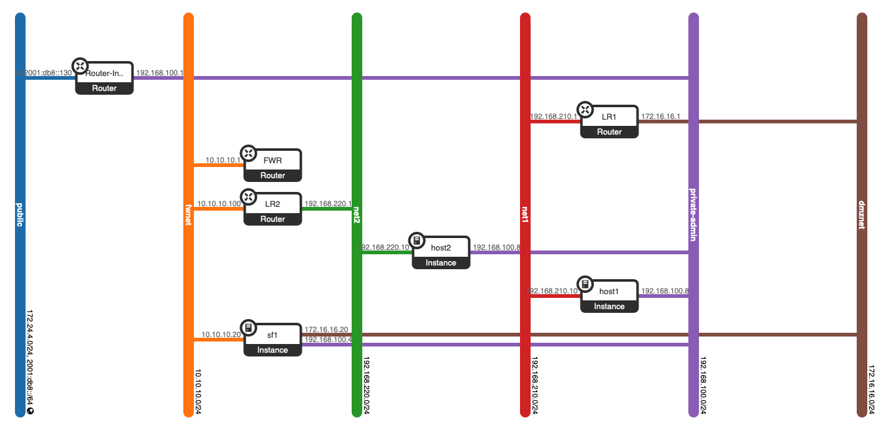
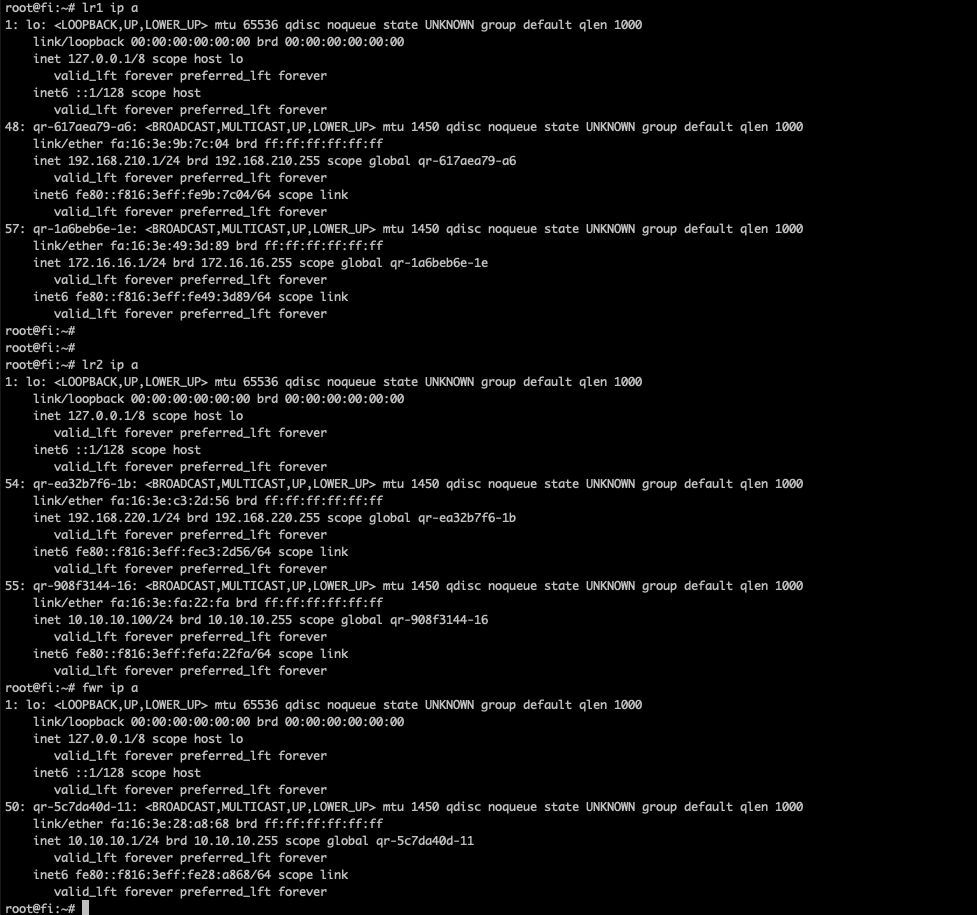
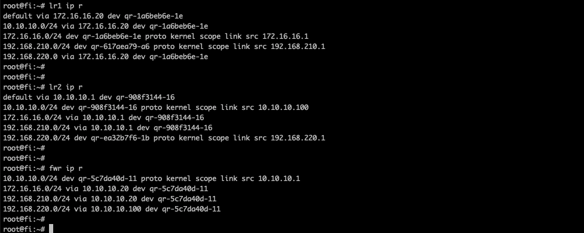

<br><b><H1>  OpenStack base Lab Setup </H1>

OS: Ubuntu Linux 18.04 LTS <br>
OpenStack Release: https://docs.openstack.org/devstack/latest/guides/single-machine.html


<b>Login to OpenStack Server -   </b>


<b>  1.  ssh backflip@131.234.26.10  </b>     
<b>  2.  ssh fi@192.168.122.10   </b>


<br>


<b>Import openstack authentication related information to run command from cli</b>

fi@fi:~$ source /opt/stack/devstack/accrc/admin/admin  


<br><b>OpenStack Dashboard:  </b>
http://131.234.26.10   
    <br>


<b> <H1> Login to VNFs using Floating IP address: </H1>

```sh
root@fi:~# cd /root  
root@fi:~# ssh -i key1.pri ubuntu@172.24.4.100

root@fi:~# cd /root  
root@fi:~# ssh -i host1.pri ubuntu@172.24.4.190  

root@fi:~# cd /root  
root@fi:~# ssh -i host2.pri ubuntu@172.24.4.209  
```

<br>

<H1> Deployment of VNF </H1>


<b> <H2> VNF Integration in OpenStack Cloud: Method 1 </H2> </b>

<b> <H3> Bridge Details: </H2>


```sh
root@sf1:~# cat bridge.sh  
!#/bin/bash   
brctl addbr br0  
ifconfig ens6 0.0.0.0 promisc  
ifconfig ens7 0.0.0.0 promisc  
brctl addif br0 ens`6  
brctl addif br0 ens7  
brctl addif br0 ens6 ens7  
ip addr add 192.168.210.20/24 dev br0  
ip addr add 192.168.220.20/24 dev br0  
ip link set dev br0 up  
```
<br>

<br>
<b><H3>Issue in bridge base setup method: </H3> </b>

1. not able to ping host1 to host2 or vice versa  
2. from VNF(sf1) we can ping either HOST1 or HOST2   
3. Need to work on bridge setup part as it's not allowing bidirectional connection  


<br><br><br><br><br><br>
<b> <H2>VNF Integration in OpenStack Cloud: Method 2 </H2> </b>


  


<br>

Fig - Network Topology view from OpenStack GUI 



<br>

```sh
root@fi:~# ip netns list  
qdhcp-e1732e7c-c4fb-43c7-9f44-f5437ceccf5c (id: 11)  
qrouter-d88ec24f-4bed-4e33-a7f8-9f877c1cdb05 (id: 10)  
qrouter-3d4999e9-93fb-4d19-8669-2d39d60868dc (id: 9)  
qdhcp-51ca4bcf-97d3-4f21-a2dd-007f7fb83469 (id: 8)  
qrouter-0ba4f245-5f80-4e05-8bec-aa1440dc4bd6 (id: 7)  
qdhcp-91fe074f-cbdf-4265-b86d-0fb19530431e (id: 6)  
qdhcp-c7675adf-32b6-4a1c-9802-24cf02008b22 (id: 5)  
qdhcp-d4b11ff5-8fca-4d16-a582-36f1843a102a (id: 4)     
qdhcp-bbc27857-4533-4ef6-aac1-8e9bdc13c282 (id: 3)  
qdhcp-24442999-3eb8-4f5f-b99b-d8e3a0d46e11 (id: 2)  
qrouter-2a655533-f24d-4437-b0a0-0c30cf1c76fc (id: 1)  
qrouter-0a8c7ddd-14fb-4882-8962-22af17f382f1 (id: 0)  
root@fi:~# cat router-alias.sh  
alias lr1="ip netns exec qrouter-0ba4f245-5f80-4e05-8bec-aa1440dc4bd6"  
alias fwr="ip netns exec qrouter-3d4999e9-93fb-4d19-8669-2d39d60868dc"  
alias lr2="ip netns exec qrouter-d88ec24f-4bed-4e33-a7f8-9f877c1cdb05"  

root@fi:~# ./router-alias.sh

```sh


Fig - Router IP information 


<br><br>
Fig - Routing table 



<br><br>
<b><H3>Issue in Method-2: </H3> </b>


1. from VNF(sf1) we can ping either HOST1 or HOST2   
2. not able to ping host1 to host2 or vice versa, it's a routing issue in the firewall which need to resolve then it will work a email filter for the outgoing email and will pass rest of the traffic transparently. 


<br>
<b>
<H1>Lessons Learned: </H1>
1. VMs connectivity to Internet or Physical Network <br>  

```sh
—missing config in devstack …. need to complete manually  
sudo ip link set br-ex up  
sudo ip route add 172.24.4.0/24 dev br-ex  
sudo ip addr add 172.24.4.1/24 dev br-ex  
add nat rule for the src address 172.24.4.1/24

permanently:   

vi /etc/netplan/01-netcfg.yaml  
  ethernets:  
    br-ex:  
      dhcp4: no  
      addresses: [172.24.4.1/24]  

 netplan apply

#apply src nat for the src address 172.24.4.1/24 and use proper outgoing interface which is connected to internet  
/sbin/iptables -t nat -A POSTROUTING -o ens160 -j MASQUERADE

```sh
<br>
<b>
<H1>Need to Study Further: </H1>
1. OpenStack Networking and it's troubleshooting <br>    
2. Linux Bridge and it's troubleshooting  <br>
3. Policy/Source base routing <br>    <br>

    


